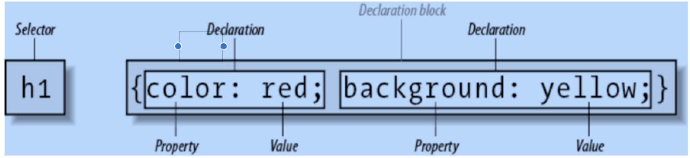

# 在HTML中加入css
## 行内
```html
<style type="text/css">
h1 {color: purple;}
p {font-size: smaller; color: gray;} 
</style>
```

## 内嵌
```html
<p style="color: red; background: yellow;">Look out! This text is alarmingly presented!</p>
```

## 外部链接
1. 使用 `@import` 进行引入
```html
<style type="text/css">
    @import url(site.css);
    @import url(navbar.css);
    @import url(footer.css) screen and (min-width: 960px); body {background: yellow;}
</style>
```
2. 使用link
```html
<link rel="stylesheet" type="text/css" href="basic.css" media="all">
```
# 规则


# @语法
## @charset
声明css文档使用的编码类型。不能够直接使用在内嵌的方式里面

## @import
允许引入

## @namespace

## @counter-style

## font-face

## @keyframes

## @media

## @supports
