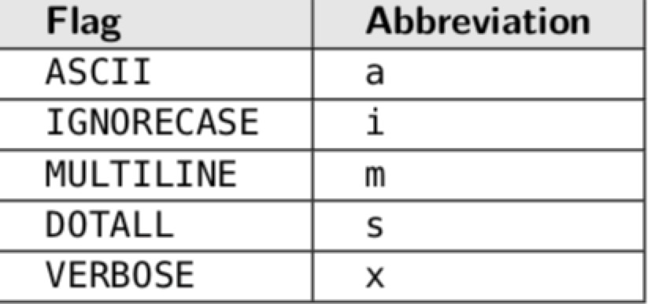

# string 模块

大多数功能已经移动到了 str 模块，string只剩下一些属性，可以很方便的生成一些ASCII数据

```python
ascii_letters='abcdefghijklmnopqrstuvwxyzABCDEFGHIJKLMNOPQRSTUVW XYZ'
ascii_lowercase='abcdefghijklmnopqrstuvwxyz'
ascii_uppercase='ABCDEFGHIJKLMNOPQRSTUVWXYZ'
digits='0123456789'
hexdigits='0123456789abcdefABCDEF'
octdigits='01234567'
printable='0123456789abcdefghijklmnopqrstuvwxyzABCDEFGHIJKLMNOPQ RSTUVWXYZ!"#$%&\'()*+,-./:;<=>?@[\\]^_`{|}~ \t\n\r\x0b\x0c'
punctuation='!"#$%&\'()*+,-./:;<=>?@[\\]^_`{|}~' whitespace=' \t\n\r\x0b\x0c'
```

# re 模块

在正则表达式，需要注意，如果使用了 `r'xxx'` 这样的表达，说明了把里面的规则当作了字符看待，如 ：\d 不再代表数字

## compile

将字符对象编译为正则对象

```
regexes = [
    re.compile(p)
    for p in ["this", "that"]
]

for reg in regexes:
    if reg.search(text):
        print(reg.pattern," matched! ")
    else:
        print(reg.pattern," not matched")

# this  matched! 
# that  not matched
```

## search

搜索符合规则的字符串

```python
import re
pattern = "t(hi)s"
text = "Does this text match the pattern"

match = re.search(pattern,text)
s = match.start()
e = match.end()

print("Found {} \nin '{}'\nfrom {} to {} ".format(pattern,text,s,e))

# 输出
Found this 
in 'Does this text match the pattern'
from 5 to 9 

# 取得符合规则的字符
print(match.group(0)) # this
print(match.group(1)) # hi
print(match.groups()) # ('hi',)
```

## findall / finditer

search 只能搜索一条结果，但是很多时候，我们需要匹配多个结果，这个时候急需要用到两个函数

1. findall
2. finditer

这两个函数的唯一不同的点是，findall 返回的是一个列表，而finditer 返回的是一个iterator对象，更加节省内存

```python
text2 = "Hi he is 23 years old and 183cm "
a = re.findall('\d+',text2)
b = re.finditer('\d+',text2)
print(a)   # ['23', '183']
print(b)   # <callable_iterator object at 0x110235c50>
```

## sub

有搜索也就有替换，sub用于匹配字符，并进行替换

```python
text2 = "Hi he is 23 years old and 183cm "
c = re.sub(
    '\d+',
    "hello",
    text2
)
print(c) #Hi he is hello years old and hellocm 
```

除此之外，还可以选择替换几个字符

```python
text = 'I have an pen 1234'
s = re.sub('have',"Hello",text,flags=re.I,count=1)
print(s) # I Hello an  have pen 1234
```

## split

切割字符串

```python
>>> re.split('[a-f]+', '0a3B9', flags=re.IGNORECASE)
['0', '3', '9']
```

## 总结

上述所有的函数，都有一个参数 为 flags, 当有换行的时候，记得声明 re.M



#  str 模块

可以直接使用 help(str) 查看其支持的函数

```
s = "hello world"
print(s.capitalize())
print(s.casefold()) 
print(s.count('h')) # 1
print(s.find('llo')) #2
print(s.index('lo')) # 3
print(s.join(['john','www'])) # johnhello worldwww
print(s.replace('lo','rl'))
print(s.splitlines())
print(s.title()) # 首字母大写
print(s.zfill(10))
print(s.strip()) 
print(s.lower())
print(s.upper())
```

爬虫的时候，如果遇到需要转码的时候，可以使用

```
'\\u0062'.encode('utf-8').decode('unicode-escape')
```