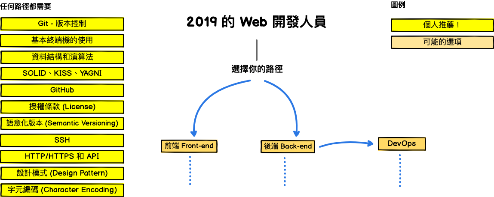
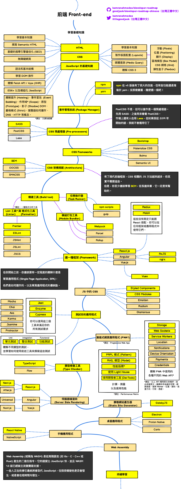
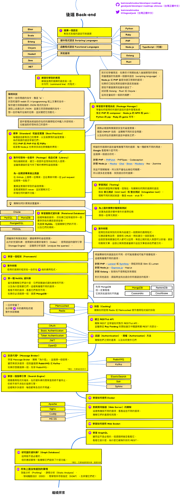
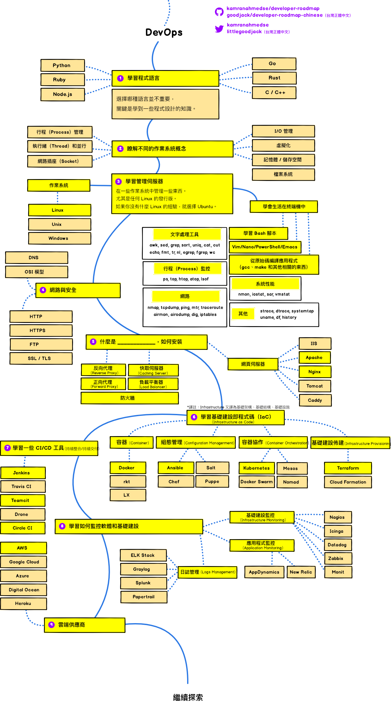

# Introduction

[Web简介](web简介.md) 

[Git操作](git操作.md) 

# FrontEnd

## 基础知识

[HTML基础](HTML基础.md)

[CSS基础](CSS基础.md) 

[JavaScript基础](JavaScript基础.md) 

## CSS

[CSS预处理器](CSS预处理器.md)

[CSS框架](CSS框架.md)

[CSS架构规范](CSS规范.md)

## 构建工具

[npm](npm.md)

[yarm](yarm.md)

## 框架
[React](React.md) 

## js中的CSS

## 渐进式网页程序

## 类型检查工具

## 桌面应用

## 手机应用

## web Assembly

# Backend

[Python基础](python基础.md) 

[python第三方模块](python进阶.md) 

[Flask](Flask基础.md) 

[Django](django基础.md) 

[go基础](go.md) 

[RestfulAPI](RestfulAPI.md) 

# DevOps

[Docker基础](docker基础.md) 

[Linux基础](Linux基础.md) 

[Docker进阶](docker进阶.md)

# Testing 
 
# Security

[API-Security-CheckList](Security/api-security-checklist.md)

